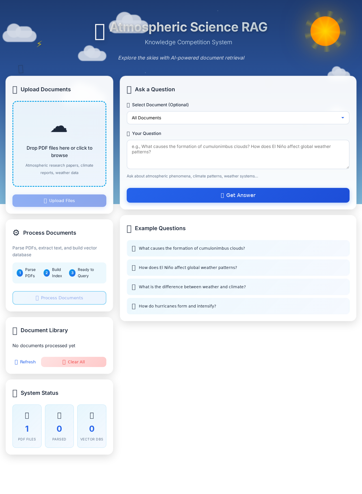

# Adaptive RAG System

A complete RAG (Retrieval-Augmented Generation) system with hierarchical retrieval (RAPTOR), multiple backends (FAISS/Chroma), and comprehensive evaluation framework. Built for atmospheric science knowledge competitions with a beautiful weather-themed UI featuring animated sky, clouds, and sun.



> 🎥 **[Watch Demo Video](demo_video.webm)** - See the weather-themed UI in action with document upload, processing, and Q&A capabilities.

## Demo

The system features a beautiful atmospheric science-themed interface:
- 🌤️ Animated gradient sky background
- ☁️ Floating clouds with drift animation
- ☀️ Pulsing sun with rotating rays
- ⚡🌧️❄️ Weather symbols floating across the screen
- 📤 Drag-and-drop PDF upload
- 🔍 Natural language query interface

## Features

- 📄 **PDF Processing**: Extract text, tables, and structure from PDFs using Docling
- 🔍 **Vector Search**: Semantic search with FAISS and OpenAI embeddings
- 🧠 **LLM Reranking**: GPT-4o-mini reranks retrieved chunks for better accuracy
- 🌐 **Web Interface**: Modern React-style UI with animated weather theme (sky, clouds, sun)
- ⚡ **Parallel Processing**: Multi-process PDF parsing for speed
- 🌳 **RAPTOR Support**: Hierarchical retrieval with tree-based document organization
- 📊 **Evaluation Framework**: Comprehensive metrics (Recall, Precision, NDCG, MRR)

## Project Structure

```
rag_system/
├── main.py                 # CLI entry point
├── requirements.txt        # Python dependencies
├── .env                    # Environment variables (API keys)
├── README.md
├── data/
│   ├── pdf_reports/       # Place your PDFs here
│   ├── debug/             # Intermediate processing data
│   ├── databases/         # Vector databases
│   └── uploads/           # Web UI uploads
├── src/
│   ├── __init__.py
│   ├── pipeline.py        # Main orchestration
│   ├── prompts.py         # LLM prompts & schemas
│   ├── pdf_parsing.py     # PDF extraction with Docling
│   ├── parsed_reports_merging.py  # Convert to markdown
│   ├── text_splitter.py   # Chunk documents
│   ├── ingestion.py       # Create vector DBs
│   ├── retrieval.py       # Vector search
│   ├── reranking.py       # LLM reranking
│   ├── tables_serialization.py  # Table processing
│   └── questions_processing.py  # Q&A logic
└── web/
    ├── __init__.py
    ├── app.py             # Flask backend
    ├── templates/
    │   └── index.html     # Main UI
    └── static/
        ├── style.css      # Modern styling
        └── app.js         # Frontend logic
```

## Setup

1. **Install Dependencies**
```bash
cd rag_system
pip install -r requirements.txt
```

2. **Set OpenAI API Key**
```bash
# Edit .env file
OPENAI_API_KEY=your_key_here
```

3. **Add Your PDFs**
Copy your PDF files to `data/pdf_reports/`

## Usage

### Option 1: Web UI (Recommended)

```bash
python main.py webui
```

Then open http://localhost:5000 in your browser.

Features:
- 📤 Drag & drop PDF upload
- ⚙️ One-click document processing
- ❓ Natural language questions
- 📊 View reasoning and retrieved context

### Option 2: Command Line

```bash
# Process all PDFs (parse, chunk, create vector DBs)
python main.py parse-pdfs --parallel
python main.py process-reports

# Or do it all at once via Python
python -c "from src.pipeline import Pipeline; p = Pipeline('.'); p.parse_pdf_reports(); p.process_parsed_reports()"
```

### Query via Python

```python
from src.pipeline import Pipeline

pipeline = Pipeline('.')
answer = pipeline.query_single("What was the total revenue in 2023?", document_name="annual_report")

print(answer['final_answer'])
print(answer['reasoning_summary'])
```

## How It Works

1. **PDF Parsing**: Docling extracts text, tables, and structure
2. **Text Splitting**: Documents chunked with 300-token overlap
3. **Vectorization**: OpenAI `text-embedding-3-large` creates embeddings
4. **Retrieval**: FAISS finds top-k similar chunks
5. **Reranking**: GPT-4o-mini scores relevance 0-1
6. **Answer Generation**: o3-mini generates structured answer with reasoning

## Configuration

Edit `src/pipeline.py` to customize:

- `chunk_size`: Text splitter chunk size (default: 300)
- `top_n_retrieval`: Number of chunks to retrieve (default: 6)
- `llm_reranking`: Enable/disable reranking
- `answering_model`: Change LLM model

## Requirements

- Python 3.9+
- OpenAI API key
- 8GB+ RAM (for PDF processing)
- Optional: GPU for faster Docling processing

## License

MIT License - Based on [RAG Challenge 2](https://github.com/IlyaRice/RAG-Challenge-2)
